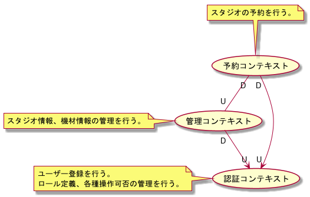
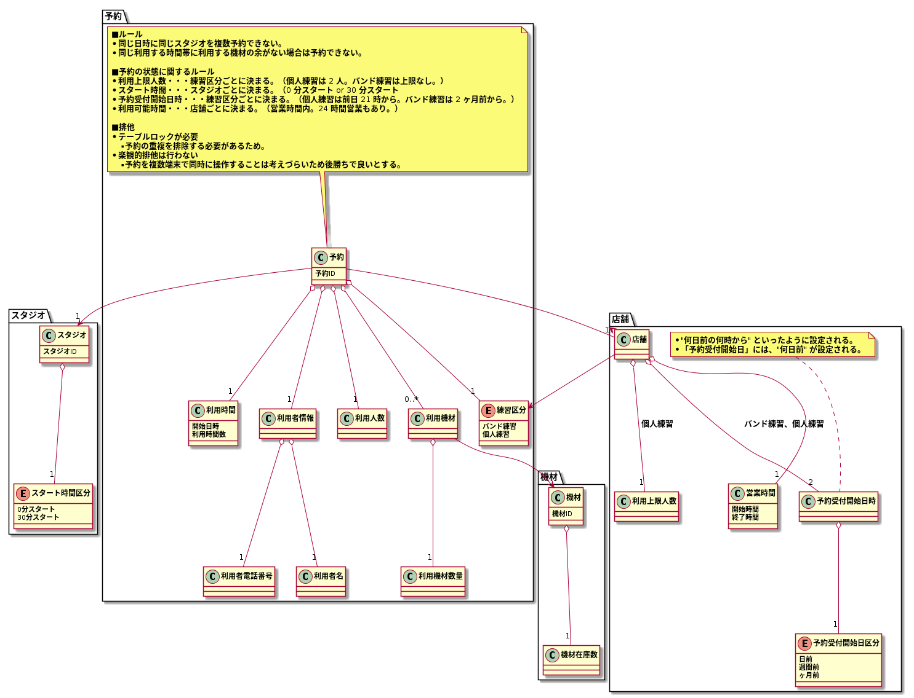
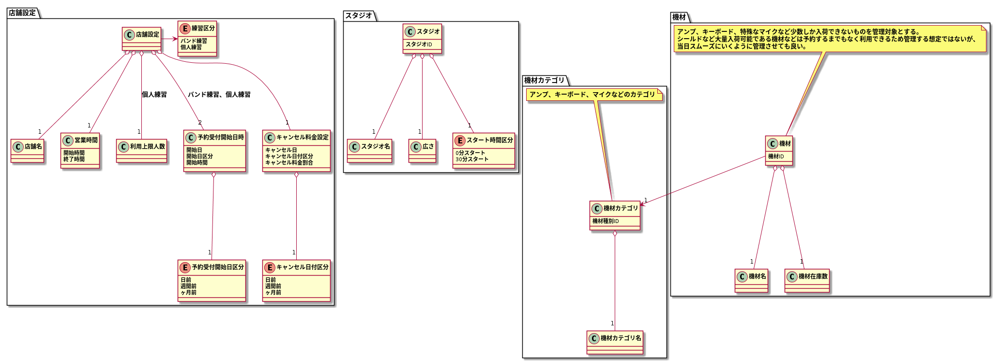
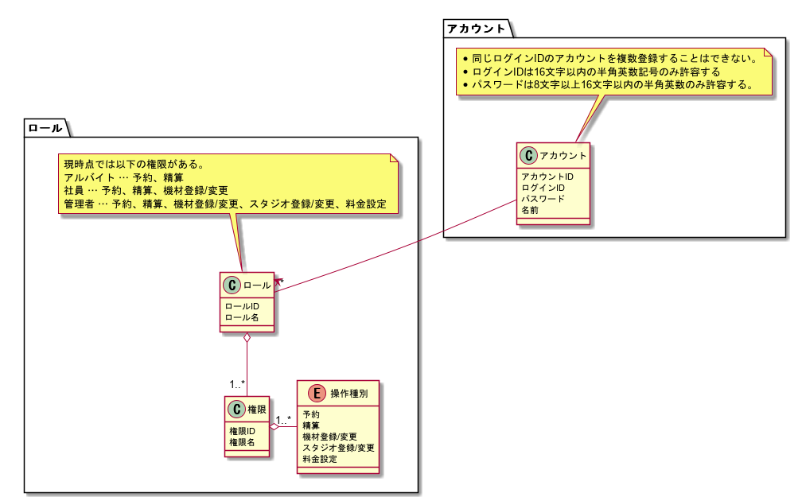

# 概要
スタジオ予約を題材とした DDD の練習プロジェクトです。

RDRA 2.0 に沿って要件定義をします。

# システムコンテキスト

# 要求モデル
### 要望

### 要件
* Web でスタジオ、機材の空き状況が確認でき、予約ができること。
* バンド練習、個人練習両方の予約ができること。
* スタジオ、機材の在庫数が管理できること。

# ビジネスコンテキスト・ビジネスユースケース
## 予約（ビジネスコンテキスト）

* ユーザーが Web で予約する「Web予約」。（Web での会員登録が必要。）
* ユーザーが電話で予約する「電話予約」。
* ユーザーが店頭で直接予約する「店頭予約」。

＜補足＞
* スタジオ利用終了後に次回の予約を行うこともある。

## 設備管理（ビジネスコンテキスト）

* スタッフが、スタジオの管理を行う「スタジオ管理」。
* スタッフが、機材の在庫管理を行う「機材管理」。

## スタジオ利用（ビジネスコンテキスト）

* スタッフが機材貸出や転換などを行う「スタジオ準備」。
* 利用者がスタジオを利用する「練習」。
* 利用者が支払いを行う「会計」。

＜補足＞
* 練習中に追加で機材を借りることもある。
* スタッフは機材が返却されたときにすべて返却されているか確認する。

# 業務フロー
TODO：ビジネスユースケースごとに業務フローを洗い出しシステムのユースケースを洗い出す。ユースケースはユースケース複合図で示す。

# サイト構成

# ユースケース
## 予約（ビジネスコンテキスト）
### Web 予約

### 電話予約

### 店頭予約

## 設備管理（ビジネスコンテキスト）
### スタジオ管理

### 機材管理

# コンテキストマップ

# ドメインモデル（予約）

# ドメインモデル（設備管理）

# ドメインモデル（認証）

# API
## Management Site
|Method|URI|説明|
|---|---|---|
|GET|/login|ログイン画面を表示する。|
|GET|/accounts|アカウント一覧画面を表示する。|
|GET|/accounts/new|アカウント登録画面を表示する。|
|POST|/accounts|アカウントを登録する。|
|GET|/reservations|予約一覧画面を表示する。|
|GET|/reservations/new|スタジオ予約画面を表示する。|
|POST|/reservations|スタジオを予約する。|

## Identity Access
|Method|URI|説明|
|---|---|---|
|POST|/accounts/login|ログインID、パスワードで認証を行う。|
|GET|/accounts|すべてのアカウントを取得する。|
|GET|/accounts/{accountId}|指定されたIDのアカウントを取得する。|
|POST|/accounts|アカウントを登録する|

## Facility Management
|Method|URI|説明|
|---|---|---|
|POST|equipment_categories|機材カテゴリを登録する。|
|GET|equipments|すべての機材を取得する。|
|PUT|equipments|機材を登録する。|
|GET|reservation_setting|予約の検証に関する設定を取得する。|
|GET|studios|すべてのスタジオを取得する。|
|PUT|studios|スタジオを登録する。|
|GET|/tenant_setting|店舗に関する設定を取得する。|
|PUT|/tenant_setting|店舗に関する設定を更新する。|

## Reservation
|Method|URI|説明|
|---|---|---|
|POST|/reservations|スタジオを予約する。|

# その他やりたいこと
### 料金の管理
* スタジオ、曜日区分、時間帯で料金が決まる
* パック料金計算
* 料金は、スタジオ、バンド練習/個人練習、土日祭、利用時間で決まる。
* 学生は 10 % OFF
* キャンセルは 1 週間前までは無料、前日までは半額、当日は全額。
* キャンセル料は個別に支払うか、次回利用の支払い時に上乗せされる。

### 料金表
#### バンド練習
|スタジオ|曜日区分|10 - 19|19 - 10|
|---|---|---|---|
|Studio A（9 畳）|平日|￥1,000/1h|￥1,500/1h|
||土日祭|￥1,500/1h|￥1,500/1h|
|Studio B（13 畳）|平日|￥1,200/1h|￥1,700/1h|
||土日祭|￥1,700/1h|￥1,700/1h|
|Studio C（15 畳）|平日|￥1,400/1h|￥1,900/1h|
||土日祭|￥1,900/1h|￥1,900/1h|
|Studio D（20 畳）|平日|￥2,000/1h|￥2,500/1h|
||土日祭|￥2,500/1h|￥2,500/1h|

#### 個人練習
|人数|曜日区分|10 - 19|19 - 10|
|---|---|---|---|
|1 名|平日|￥500/1h|￥700/1h|
||土日祭|￥700/1h|￥700/1h|
|2 名|平日|￥800/1h|￥1,000/1h|
||土日祭|￥1,000/1h|￥1,000/1h|

# メモ
* 予約を作成する際の条件は仕様クラスにまとめている。予約クラス内でチェック処理を実装することもできるが、条件の設定を DB に持たせたときに、エンティティから DB アクセスしないようにするためである。例えば、マルチテナントの時に利用最大人数や予約受付開始時間などがテナントごとに異なることが考えられ、テナントごとに実装を変えるよりも設定を変えるだけで済んだほうが安いと考える。

# 参考
* [PlantUML Example for RDRA 2.0 ハンドブック](https://qiita.com/ogomr/items/97058a87337eaa2ba21a)