# はじめに
ドメインモデルを作成する流れを追った資料です。
重要な業務を選択し、ドメインモデリングを行います。
今回の場合は、「予約」、「スタジオ利用」、「会計」を選択しました。
業務フロー/利用シーンの作成と並行して実施すると良いかもしれない。

# モデリングの方法
- コアドメインに着目してモデリングしていく。
  - RDRA で定義したビジネスコンテキストから重要な業務を選択する。
  - 今回は、「予約」、「スタジオ利用」を主要業務と捉えた。
- 業務に対応づけられたビジネスユースケース、業務フロー/利用シーンを元に少しずつモデリングしていく。

# BUC: Web予約に着目したモデリング


## 予約
「予約」の業務フローを満たすためのモデリングを行います。
まずは予約に必要な最低限の情報は何かを議論してモデリングします。

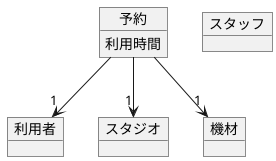

このドメインモデルをベースとして議論を深めていき、新たに発見したビジネスルールに基づいてドメインモデルを育てていきます。

### ビジネスルールの発見
予約する際に練習区分としてバンド練習と個人練習が存在することが分かったため、ドメインモデルを更新します。
発見したビジネスルールはドメインモデルを説明する補足情報として文章で残しておくと、実装する際の手助けとなると思います。

```markdown
# ビジネスルール
## 予約
- 練習区分として、バンド練習と個人練習がある。
- 練習区分ごとに最大利用人数が決まる。
  - 個人練習の最大利用人数は 2 名までなど。
- 練習区分ごとに予約受付開始日時が決まる。
  - 個人練習は前日 21 時から、バンド練習は 2 ヶ月前からなど。
```

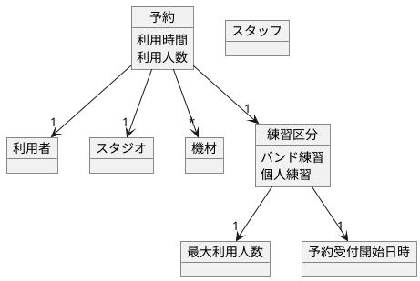

### ビジネスルールの発見
他にも予約の情報を元に決まる内容がないかを議論したところ、スタジオごとに決まる内容が存在することが分かったため、同じようにドメインモデルを更新します。

```markdown
# ビジネスルール
## 予約
- 練習区分として、バンド練習と個人練習がある。
- 練習区分ごとに最大利用人数が決まる。
  - 個人練習の最大利用人数は 2 名までなど。
- 練習区分ごとに予約受付開始日時が決まる。
  - 個人練習は前日 21 時から、バンド練習は 2 ヶ月前からなど。
- スタジオごとにスタート時間が決まる。
  - スタジオ A は 0 分スタート、スタジオ B は 30 分スタート、など。
- スタジオごとに各機材カテゴリの最大利用数が決まる。
  - スタジオ A はアンプを 2 個までしか借りられない、など。
```

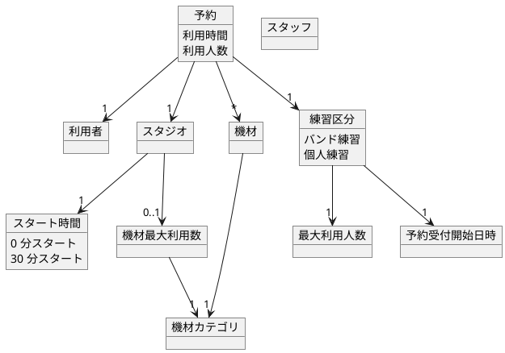

### ビジネスルールの発見
このように議論を重ね、「予約」の業務フローについては以下のドメインモデルとなりました。

```markdown
# ビジネスルール
## 予約
- 練習区分として、バンド練習と個人練習がある。
- 練習区分ごとに最大利用人数が決まる。
  - 個人練習の最大利用人数は 2 名までなど。
- 練習区分ごとに予約受付開始日時が決まる。
  - 個人練習は前日 21 時から、バンド練習は 2 ヶ月前からなど。
- スタジオごとにスタート時間が決まる。
  - スタジオ A は 0 分スタート、スタジオ B は 30 分スタート、など。
- スタジオごとに各機材カテゴリの最大利用数が決まる。
  - スタジオ A はアンプを 2 個までしか借りられない、など。
- 予約時間の単位は 1 時間である。
- 営業時間を超えた予約を行うことはできない。
```

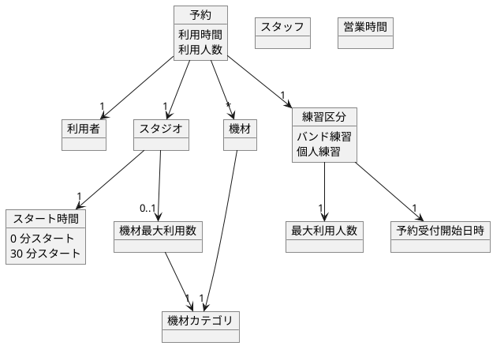

## 予約変更
続いて、「予約変更」の業務フローを満たすためのモデリングを行います。

### ビジネスルールの発見
予約変更可能かどうかの条件が存在することが分かりました。
また、キャンセル料金が発生するかどうかによって変更できる内容が決まることが分かりました。
そこから、キャンセル料金設定というモデルが発見されました。

```markdown
# ビジネスルール
## 予約
- 練習区分として、バンド練習と個人練習がある。
- 練習区分ごとに最大利用人数が決まる。
  - 個人練習の最大利用人数は 2 名までなど。
- 練習区分ごとに予約受付開始日時が決まる。
  - 個人練習は前日 21 時から、バンド練習は 2 ヶ月前からなど。
- スタジオごとにスタート時間が決まる。
  - スタジオ A は 0 分スタート、スタジオ B は 30 分スタート、など。
- スタジオごとに各機材カテゴリの最大利用数が決まる。
  - スタジオ A はアンプを 2 個までしか借りられない、など。
- 予約時間の単位は 1 時間である。
- 営業時間を超えた予約を行うことはできない。

## 予約変更
- キャンセル利用金が発生する場合は変更できる内容が制限される。
  - スタジオは変更できない、利用時間は増やすことはできる、など。
- 利用開始日時を過ぎている場合は予約変更はできない。

## キャンセル料金
- 利用日の何日前から何%といったように決められる。
```

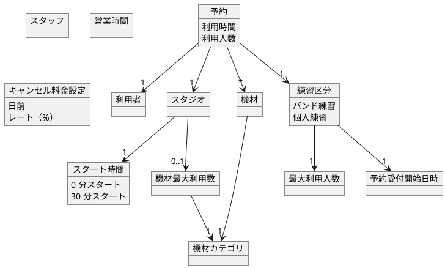
## 予約キャンセル
続いて、「予約キャンセル」の業務フローを満たすためのモデリングを行います。

### ビジネスルールの発見
予約には、キャンセルとい状態が存在することが分かりました。
また、キャンセル料金が発生する場合は利用者によるキャンセルは行えず、電話もしくは店頭でのキャンセルが必要であることが分かりました。
その他にも、利用者とスタッフで一部のビジネスルールが異なることが分かりました。

```markdown
# ビジネスルール
## 予約
- 練習区分として、バンド練習と個人練習がある。
- 練習区分ごとに最大利用人数が決まる。
  - 個人練習の最大利用人数は 2 名までなど。
- 練習区分ごとに予約受付開始日時が決まる。
  - 個人練習は前日 21 時から、バンド練習は 2 ヶ月前からなど。
- スタジオごとにスタート時間が決まる。
  - スタジオ A は 0 分スタート、スタジオ B は 30 分スタート、など。
- スタジオごとに各機材カテゴリの最大利用数が決まる。
  - スタジオ A はアンプを 2 個までしか借りられない、など。
- 予約時間の単位は 1 時間である。
- 営業時間を超えた予約を行うことはできない。

## 予約変更
- キャンセル利用金が発生する場合は変更できる内容が制限される。
  - スタジオは変更できない、利用時間は増やすことはできる、など。
- 利用開始日時を過ぎている場合は、利用者による予約変更はできない。
  - スタッフによる変更は可能である。
  - スタジオ利用中に機材を追加予約することがあるため。

## 予約キャンセル
- キャンセル料金が発生する場合は、利用者によるキャンセルはできない。
  - 電話もしくは店頭でキャンセルするしかない。
  - キャンセル料金を請求する必要があるためである。
  - スタッフによるキャンセルは可能である。
- 利用開始日時を過ぎている場合は、利用者によるキャンセルはできない。
  - スタッフによるキャンセルは可能である。
  - 当日無断で利用者が来ないことを想定するため。

## キャンセル料金
- 利用日の何日前から何%といったように決められる。
```

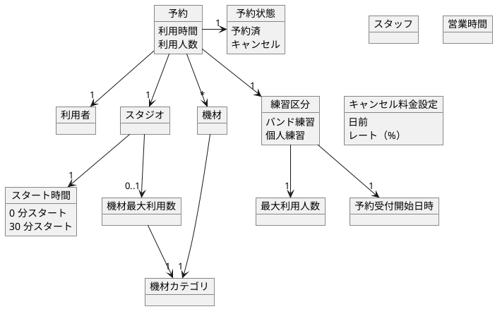

# BUC: 電話/店頭予約に着目したモデリング


## 予約
「予約」の業務フローを満たすためのモデリングを行います。

### ビジネスルールの発見
電話/店頭予約では、利用者が非会員だったとしても予約できなければならないことが分かりました。
利用者が非会員の場合は、予約の利用者情報として利用者名と電話番号が必要です。
利用者が会員の場合は、予約に対して会員アカウントが紐づけられます。

```markdown
# ビジネスルール
## 予約
- 練習区分として、バンド練習と個人練習がある。
- 練習区分ごとに最大利用人数が決まる。
  - 個人練習の最大利用人数は 2 名までなど。
- 練習区分ごとに予約受付開始日時が決まる。
  - 個人練習は前日 21 時から、バンド練習は 2 ヶ月前からなど。
- スタジオごとにスタート時間が決まる。
  - スタジオ A は 0 分スタート、スタジオ B は 30 分スタート、など。
- スタジオごとに各機材カテゴリの最大利用数が決まる。
  - スタジオ A はアンプを 2 個までしか借りられない、など。
- 予約時間の単位は 1 時間である。
- 営業時間を超えた予約を行うことはできない。
- 非会員による予約の場合は、利用者情報として利用者名と電話番号が必要。
- 会員による予約の場合は、予約に対して会員アカウントが紐づけられる。

## 予約変更
- キャンセル利用金が発生する場合は変更できる内容が制限される。
  - スタジオは変更できない、利用時間は増やすことはできる、など。
- 利用開始日時を過ぎている場合は、利用者による予約変更はできない。
  - スタッフによる変更は可能である。
  - スタジオ利用中に機材を追加予約することがあるため。

## 予約キャンセル
- キャンセル料金が発生する場合は、利用者によるキャンセルはできない。
  - 電話もしくは店頭でキャンセルするしかない。
  - キャンセル料金を請求する必要があるためである。
  - スタッフによるキャンセルは可能である。
- 利用開始日時を過ぎている場合は、利用者によるキャンセルはできない。
  - スタッフによるキャンセルは可能である。
  - 当日無断で利用者が来ないことを想定するため。

## キャンセル料金
- 利用日の何日前から何%といったように決められる。
```

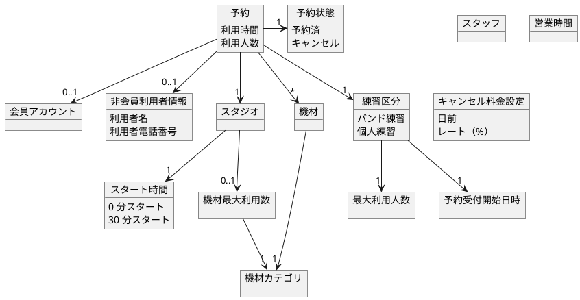

### ビジネスルールの発見
利用者が予約の意思決定をするために、利用料金を伝えなければなりません。よって、予約時点で利用料金が決まっていなければなりません。
利用料金は基本的に予約対象のスタジオや利用時間によって決まりますが、店舗によってルールが異なります。
利用料金にはパック料金といったものもあります。
機材にはレンタル料金が設定されます。

```markdown
# ビジネスルール
## 予約
- 練習区分として、バンド練習と個人練習がある。
- 練習区分ごとに最大利用人数が決まる。
  - 個人練習の最大利用人数は 2 名までなど。
- 練習区分ごとに予約受付開始日時が決まる。
  - 個人練習は前日 21 時から、バンド練習は 2 ヶ月前からなど。
- スタジオごとにスタート時間が決まる。
  - スタジオ A は 0 分スタート、スタジオ B は 30 分スタート、など。
- スタジオごとに各機材カテゴリの最大利用数が決まる。
  - スタジオ A はアンプを 2 個までしか借りられない、など。
- 予約時間の単位は 1 時間である。
- 営業時間を超えた予約を行うことはできない。
- 非会員による予約の場合は、利用者情報として利用者名と電話番号が必要。
- 会員による予約の場合は、予約に対して会員アカウントが紐づけられる。

## 予約変更
- キャンセル利用金が発生する場合は変更できる内容が制限される。
  - スタジオは変更できない、利用時間は増やすことはできる、など。
- 利用開始日時を過ぎている場合は、利用者による予約変更はできない。
  - スタッフによる変更は可能である。
  - スタジオ利用中に機材を追加予約することがあるため。

## 予約キャンセル
- キャンセル料金が発生する場合は、利用者によるキャンセルはできない。
  - 電話もしくは店頭でキャンセルするしかない。
  - キャンセル料金を請求する必要があるためである。
  - スタッフによるキャンセルは可能である。
- 利用開始日時を過ぎている場合は、利用者によるキャンセルはできない。
  - スタッフによるキャンセルは可能である。
  - 当日無断で利用者が来ないことを想定するため。

## キャンセル料金
- 利用日の何日前から何%といったように決められる。

## 利用料金
- 基本利用料金、パック料金を設定できる。
- 基本利用料金について
  - 利用対象のスタジオ、曜日、時間帯、利用人数などで料金が決まる。
    - 例えば、スタジオ A は平日 9:00 - 19:00 の間は ¥1,500/1h といった感じ。
    - 店舗によって条件が異なるため、設定に自由度が必要。
  - バンド練習、個人練習それぞれに対して設定できる。
- パック料金について
  - 長時間利用の場合にお得な料金として設定できる。
    - 例えば、23:00 - 10:00 の間は 3h 以上で ¥4,000 といった感じ。
    - 色々な条件で設定できる必要があるため、設定に自由度が必要。
  - バンド練習にのみ適用される。
```

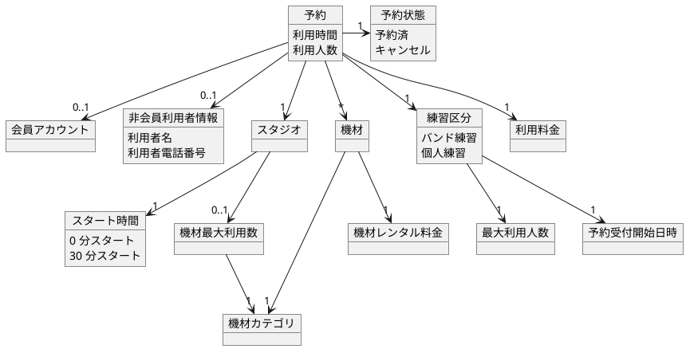
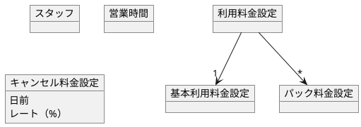

## 予約変更
「予約変更」の業務フローを満たすためのモデリングを行います。

### ビジネスルールの発見
特に新たなビジネスルールは発見できなかったため、モデルは更新しません。

## 予約キャンセル
「予約キャンセル」の業務フローを満たすためのモデリングを行います。

### ビジネスルールの発見
予約をキャンセルする際にキャンセル料金を伝えるためにキャンエル料金を伝えなければなりません。
現在の「利用料金」というモデルがありますが、利用料金だけでなくキャンセル料金もあります。
料金は利用者に "請求" するものなので、「請求」というモデルを新たに追加し、「請求」の中に「基本利用料金明細」、「パック料金明細」、「機材レンタル料金明細」、「キャンセル料金明細」がある、という形にしました。

```markdown
# ビジネスルール
## 予約
- 練習区分として、バンド練習と個人練習がある。
- 練習区分ごとに最大利用人数が決まる。
  - 個人練習の最大利用人数は 2 名までなど。
- 練習区分ごとに予約受付開始日時が決まる。
  - 個人練習は前日 21 時から、バンド練習は 2 ヶ月前からなど。
- スタジオごとにスタート時間が決まる。
  - スタジオ A は 0 分スタート、スタジオ B は 30 分スタート、など。
- スタジオごとに各機材カテゴリの最大利用数が決まる。
  - スタジオ A はアンプを 2 個までしか借りられない、など。
- 予約時間の単位は 1 時間である。
- 営業時間を超えた予約を行うことはできない。
- 非会員による予約の場合は、利用者情報として利用者名と電話番号が必要。
- 会員による予約の場合は、予約に対して会員アカウントが紐づけられる。

## 予約変更
- キャンセル利用金が発生する場合は変更できる内容が制限される。
  - スタジオは変更できない、利用時間は増やすことはできる、など。
- 利用開始日時を過ぎている場合は、利用者による予約変更はできない。
  - スタッフによる変更は可能である。
  - スタジオ利用中に機材を追加予約することがあるため。

## 予約キャンセル
- キャンセル料金が発生する場合は、利用者によるキャンセルはできない。
  - 電話もしくは店頭でキャンセルするしかない。
  - キャンセル料金を請求する必要があるためである。
  - スタッフによるキャンセルは可能である。
- 利用開始日時を過ぎている場合は、利用者によるキャンセルはできない。
  - スタッフによるキャンセルは可能である。
  - 当日無断で利用者が来ないことを想定するため。

## キャンセル料金
- 利用日の何日前から何%といったように決められる。

## 利用料金
- 基本利用料金、パック料金を設定できる。
- 基本利用料金について
  - 利用対象のスタジオ、曜日、時間帯、利用人数などで料金が決まる。
    - 例えば、スタジオ A は平日 9:00 - 19:00 の間は ¥1,500/1h といった感じ。
    - 店舗によって条件が異なるため、設定に自由度が必要。
  - バンド練習、個人練習それぞれに対して設定できる。
- パック料金について
  - 長時間利用の場合にお得な料金として設定できる。
    - 例えば、23:00 - 10:00 の間は 3h 以上で ¥4,000 といった感じ。
    - 色々な条件で設定できる必要があるため、設定に自由度が必要。
  - バンド練習にのみ適用される。
```

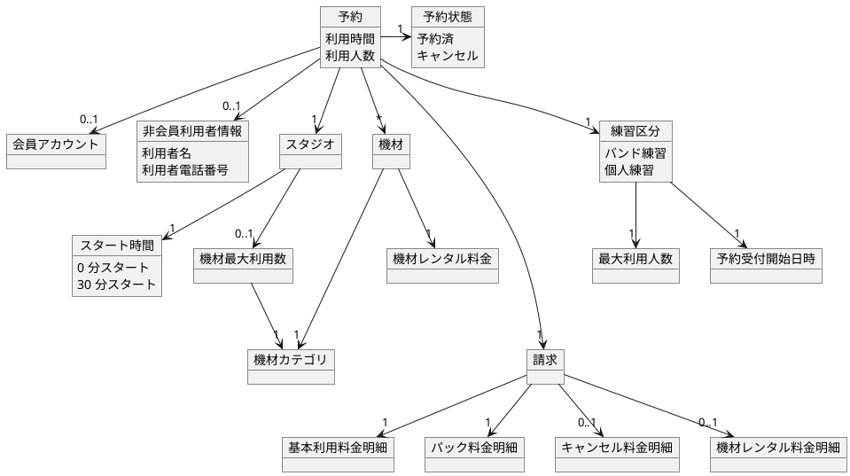


# BUC: スタジオ準備に着目したモデリング


## スタジオ準備
「スタジオ準備」の業務フローを満たすためのモデリングを行います。

### ビジネスルールの発見
特に新たなビジネスルールは発見できなかったため、モデルは更新しません。

# BUC: 受付に着目したモデリング


## 受付
「受付」の業務フローを満たすためのモデリングを行います。

### ビジネスルールの発見
特に新たなビジネスルールは発見できなかったため、モデルは更新しません。

# BUC: スタジオ利用に着目したモデリング


## スタジオ利用
「スタジオ利用」の業務フローを満たすためのモデリングを行います。

### ビジネスルールの発見
特に新たなビジネスルールは発見できなかったため、モデルは更新しません。

# BUC: 会計に着目したモデリング


## 会計
「会計」の業務フローを満たすためのモデリングを行います。

### ビジネスルールの発見
請求に対する支払い状態を管理する必要があります。

```markdown
# ビジネスルール
## 予約
- 練習区分として、バンド練習と個人練習がある。
- 練習区分ごとに最大利用人数が決まる。
  - 個人練習の最大利用人数は 2 名までなど。
- 練習区分ごとに予約受付開始日時が決まる。
  - 個人練習は前日 21 時から、バンド練習は 2 ヶ月前からなど。
- スタジオごとにスタート時間が決まる。
  - スタジオ A は 0 分スタート、スタジオ B は 30 分スタート、など。
- スタジオごとに各機材カテゴリの最大利用数が決まる。
  - スタジオ A はアンプを 2 個までしか借りられない、など。
- 予約時間の単位は 1 時間である。
- 営業時間を超えた予約を行うことはできない。
- 非会員による予約の場合は、利用者情報として利用者名と電話番号が必要。
- 会員による予約の場合は、予約に対して会員アカウントが紐づけられる。

## 予約変更
- キャンセル利用金が発生する場合は変更できる内容が制限される。
  - スタジオは変更できない、利用時間は増やすことはできる、など。
- 利用開始日時を過ぎている場合は、利用者による予約変更はできない。
  - スタッフによる変更は可能である。
  - スタジオ利用中に機材を追加予約することがあるため。
- 請求を支払い済の場合は、予約変更はできない。

## 予約キャンセル
- キャンセル料金が発生する場合は、利用者によるキャンセルはできない。
  - 電話もしくは店頭でキャンセルするしかない。
  - キャンセル料金を請求する必要があるためである。
  - スタッフによるキャンセルは可能である。
- 利用開始日時を過ぎている場合は、利用者によるキャンセルはできない。
  - スタッフによるキャンセルは可能である。
  - 当日無断で利用者が来ないことを想定するため。
- 請求を支払い済の場合は、キャンセルはできない。

## キャンセル料金
- 利用日の何日前から何%といったように決められる。

## 利用料金
- 基本利用料金、パック料金を設定できる。
- 基本利用料金について
  - 利用対象のスタジオ、曜日、時間帯、利用人数などで料金が決まる。
    - 例えば、スタジオ A は平日 9:00 - 19:00 の間は ¥1,500/1h といった感じ。
    - 店舗によって条件が異なるため、設定に自由度が必要。
  - バンド練習、個人練習それぞれに対して設定できる。
- パック料金について
  - 長時間利用の場合にお得な料金として設定できる。
    - 例えば、23:00 - 10:00 の間は 3h 以上で ¥4,000 といった感じ。
    - 色々な条件で設定できる必要があるため、設定に自由度が必要。
  - バンド練習にのみ適用される。
```

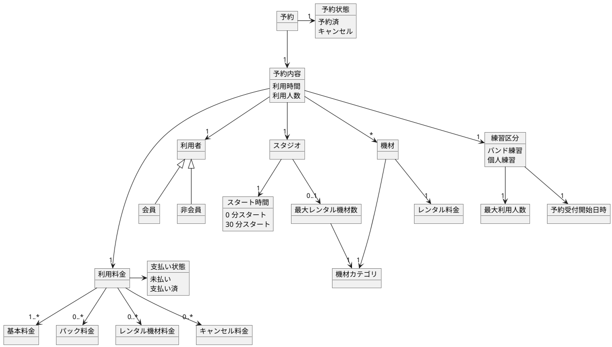
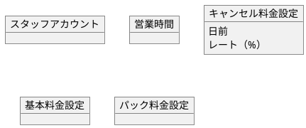


# 詳細なビジネスルール
## 予約の変更可否
- 変更可否は以下のルールとする。
  - 利用スタジオの変更
    - キャンセル料金が発生しない場合
      - 変更可能。
    - キャンセル料金が発生する場合
      - 変更不可能。
  - 利用日時の変更
    - キャンセル料金が発生しない場合
      - 変更可能。
    - キャンセル料金が発生する場合
      - 時間を増やすことは可能。
      - 時間を減らすことは不可能。
  - 練習区分の変更
    - キャンセル料金が発生しない場合
      - 変更可能。
    - キャンセル料金が発生する場合
      - 個人練習からバンド練習への変更は可能。
      - バンド練習から個人練習への変更は不可能。
  - 利用人数の変更
    - キャンセル料金が発生しない場合
      - 変更可能。
    - キャンセル料金が発生する場合
      - 人数を増やすことは可能。
      - 人数を減らすことは不可能。
  - 利用機材の変更
    - キャンセル料金が発生しない場合
      - 変更可能。
    - キャンセル料金が発生する場合
      - 利用数量を増やすことは可能。
      - 利用数量を減らすことは不可能。
- 予約が変更された場合、利用料金は再計算する。

## キャンセル料金
- キャンセル料金例
  | 条件 | キャンセル料金レート |
  | --- | --- |
  | 1 週間前（7 日前）から | 20 % |
  | 前日（1 日前）から | 50 % |
  | 当日（0 日前）から | 100 % |

## 利用料金設定
- バンド練習利用料金例
  |スタジオ|曜日区分|10 - 19|19 - 10|
  |---|---|---|---|
  |Studio A（9 畳）|平日|￥1,000/1h|￥1,500/1h|
  ||土日祭|￥1,500/1h|￥1,500/1h|
  |Studio B（13 畳）|平日|￥1,200/1h|￥1,700/1h|
  ||土日祭|￥1,700/1h|￥1,700/1h|
  |Studio C（15 畳）|平日|￥1,400/1h|￥1,900/1h|
  ||土日祭|￥1,900/1h|￥1,900/1h|
  |Studio D（20 畳）|平日|￥2,000/1h|￥2,500/1h|
  ||土日祭|￥2,500/1h|￥2,500/1h|

- 個人練習利用料金例
  |人数|曜日区分|10 - 19|19 - 10|
  |---|---|---|---|
  |1 名|平日|￥500/1h|￥700/1h|
  ||土日祭|￥700/1h|￥700/1h|
  |2 名|平日|￥800/1h|￥1,000/1h|
  ||土日祭|￥1,000/1h|￥1,000/1h|

- パック料金例（デイパック）
  |スタジオ|曜日区分|利用時間|10 - 19|
  |---|---|---|---|
  |Studio A（9 畳）|平日|3h 以上|￥900/1h|
  |Studio B（13 畳）|平日|3h 以上|￥1,000/1h|
  |Studio C（15 畳）|平日|3h 以上|￥1,200/1h|
  |Studio D（20 畳）|平日|3h 以上|￥1,400/1h|

- パック料金例（オールナイトパック）
  |スタジオ|曜日区分|利用時間|23 - 10|
  |---|---|---|---|
  |全スタジオ|全日|3h 以上|￥4,000|
  |全スタジオ|全日|4h 以上|￥5,000|
  |全スタジオ|全日|5h 以上|￥6,000|
  |全スタジオ|全日|6h 以上|￥7,000|
